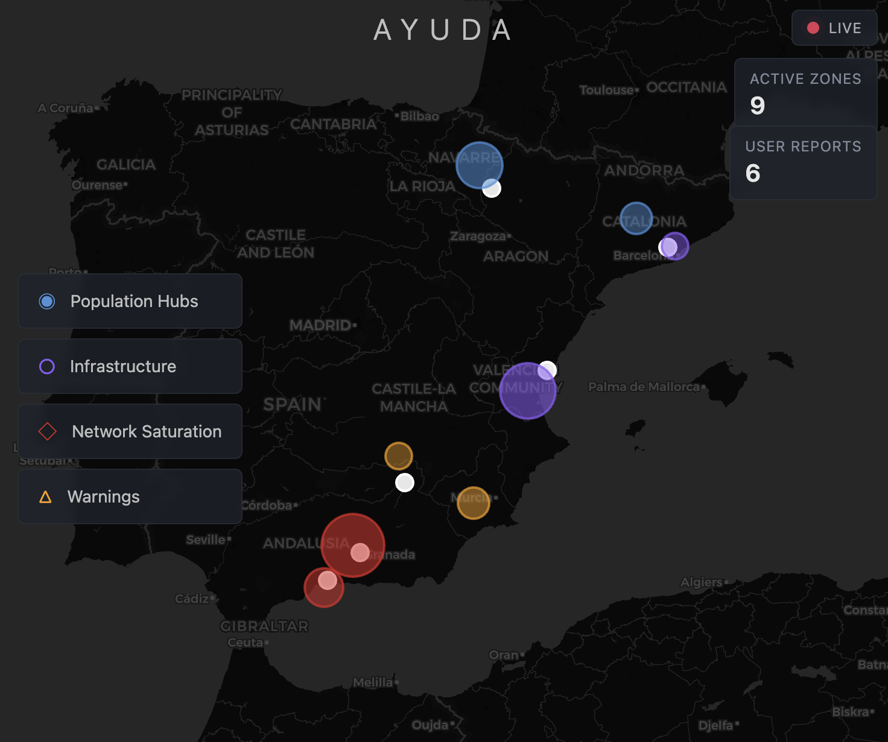

# AYUDA, Crisis Intelligence from the Ground Up (Claude x Imperial College London Spring 2026 Hackathon)

## *AWARDED 2nd PLACE overall among +430 Participants and 1st PLACE in Track 4: Governance & Collaboration* 

### Idea -> Build in 2 Hours 30 Minutes

---

## What it does

AYUDA turns WhatsApp — the world's most used messaging app — and SMS into a crisis reporting tool. When disaster strikes, citizens send messages, photos, and locations via WhatsApp to an AYUDA bot; SMS serves as a backup when lines are down. The bot gently collects what it needs, tags urgency, and routes every report to a live geospatial coordinator dashboard. Coordinators see citizen ground truth overlaid with official satellite data (NASA fire detections, flood zones, weather alerts), triage incoming reports, and export everything to the formats that real crisis systems use (CAP XML for FEMA/EU ERCC, GeoJSON for GIS, CSV for everything else).

No app to download. No account to create. Works on any phone that has WhatsApp — which means 2 billion people are already onboarded.

*Pitch Video: https://youtu.be/5jsaZTBqL4I*



---

## The Problem

When disasters hit, emergency coordinators work from satellite data and models. But the family watching fire approach their house sees reality **before any satellite does**. That information exists, but there is no structured way to get it to the people making life-or-death resource allocation decisions.

This isn't hypothetical:

- **Valencia, Spain (October 2024):** The regional government sent mobile flood alerts 12 hours after the national weather agency raised the alarm. By then, water was already in homes. 223 people died. Over half the victims were over 70.
- **Globally:** 90% of disaster survivors are rescued by their own neighbours. Yet communities are systematically excluded from the planning and coordination that determines who gets help and when.

The pattern repeats everywhere: warnings fail to reach the most vulnerable, communities self-organise chaotically, recovery decisions are made without the people most affected, and trust collapses.

---

## Our Approach

AYUDA applies open democracy principles to crisis management. Grounded in Hélène Landemore's *Open Democracy* framework (Yale), we believe the people closest to a crisis have the most valuable knowledge — and that transparency, participation, and structured deliberation aren't luxuries to suspend during emergencies. They're necessities.

### How it works

```
Citizen in crisis
    → sends WhatsApp or SMS message (text, photo, location)
    → AYUDA bot asks gently for missing info (one follow-up max)
    → report lands on Coordinator Dashboard (geospatial map)
    → dashboard overlays official crisis data (NASA FIRMS, NWS alerts, flood zones)
    → coordinator triages, corroborates, or flags discrepancies
    → exports to real crisis systems (CAP 1.2 XML, GeoJSON, CSV)
```

### The bot

- Calm, short, human. Never robotic. Never demanding. These people are in danger.
- State machine: collects what's available, asks for location if missing (once), accepts text place names as fallback via geocoding, never pesters.
- Tags reports by crisis type (fire, flood, trapped, medical) and urgency (critical, high, normal).
- Supports English, Spanish, French, and Portuguese for the demo.
- Rate-limited to prevent flooding the system.

### The dashboard

- Full-viewport Leaflet map with citizen reports colour-coded by status (new, reviewed, actioned, flagged).
- Overlays NASA FIRMS satellite fire detections and Overpass flood data for ground-truth comparison.
- One-click triage: Mark Reviewed, Corroborate, Flag Discrepancy.
- Critical reports pulse red and sort to the top.
- Real-time polling — new reports appear with no page refresh.
- Export panel: CSV, CAP 1.2 XML (IPAWS/EU ERCC compatible), GeoJSON (ArcGIS/QGIS compatible).

---

## Why WhatsApp?

- 2 billion users globally. Already the default crisis communication tool in the Global South, Southern Europe, and most of the world outside the US.
- No app download required. No signup. No learning curve.
- Works on low-end phones with poor connectivity.
- Supports text, images, and GPS location sharing natively.

---

## Technical Architecture

```
┌───────────────┐    ┌───────────┐    ┌───────────────┐
│  Citizen on   │    │  Twilio   │    │  Flask + bot  │
│  WhatsApp     │───>│  Webhook  │───>│  /webhook     │
└───────────────┘    └───────────┘    └─────┬─────────┘
                                            │
                                    ┌───────┴────────┐
                                    │   In-memory    │
                                    │   reports[]    │
                                    └───────┬────────┘
                                            │
                     ┌──────────┬───────────┼───────────┬──────────┐
                     │          │           │           │          │
               ┌─────┴────┐ ┌──┴───────┐ ┌─┴───────┐ ┌┴────────┐ │
               │Dashboard │ │NASA FIRMS│ │Overpass │ │NWS Alerts│ │
               │(Leaflet) │ │(fire)    │ │(flood)  │ │(weather) │ │
               └──────────┘ └──────────┘ └─────────┘ └──────────┘ │
```

### Stack
- **Backend:** Python / Flask
- **Bot:** Twilio WhatsApp Sandbox + custom state machine
- **Frontend:** Vanilla JS + Leaflet.js (single HTML file, no build step)
- **Data:** NASA FIRMS (fire), Overpass API (flood/water), NWS (weather alerts), Nominatim (geocoding)
- **Export:** CAP 1.2 XML, GeoJSON, CSV

### APIs used (all free)
| Service | Purpose | Auth |
|---------|---------|------|
| Twilio WhatsApp Sandbox | Receive/send WhatsApp messages | Account SID + Token |
| NASA FIRMS | Satellite fire detections | Free API key |
| Overpass API | Flood zones and water features | None |
| NWS Alerts | Active weather alerts | None |
| Nominatim | Geocode place names to coordinates | None |

---

## Ethical Considerations

### Who benefits?
Citizens in crisis — particularly the most vulnerable: elderly residents, non-native speakers, people in areas not covered by official monitoring. Coordinators who currently work with incomplete information.

### Who could be harmed and what safeguards exist?

- **Privacy:** Phone numbers are anonymised to last 4 digits in reports. No login. No personal data beyond what the citizen voluntarily shares. Location data is used only for crisis coordination.
- **Misinformation:** Reports default to "unverified." The corroboration workflow lets coordinators cross-reference against satellite data. Flagged discrepancies are visually distinct — they're not hidden, but they're clearly marked.
- **Manipulation:** Rate limiting prevents spam. The system is designed for coordination, not broadcast — citizens report, coordinators act. There's no public feed that could be gamed.
- **Accessibility:** WhatsApp is the lowest-friction entry point possible. Multilingual support ensures language isn't a barrier. No app download, no account creation.
- **AI role:** AI assists with keyword extraction, urgency tagging, and multilingual detection. It does not make decisions. Humans triage. Humans act. AI structures the information flow.

### How does this help people rather than make decisions for them?
AYUDA gives communities a structured voice during crises. It doesn't replace emergency services or democratic institutions — it feeds ground truth into them. The citizen reports, the coordinator decisions, and the exports are all transparent and auditable.

---

## How to run it

### Prerequisites
- Python 3.11+
- A Twilio account (free trial works)
- ngrok (free tier)

### Setup
```bash
git clone <repo-url>
cd ayuda
python3 -m venv venv && source venv/bin/activate
pip install -r requirements.txt
```

### Configure
Create `.env`:
```
TWILIO_ACCOUNT_SID=your_sid
TWILIO_AUTH_TOKEN=your_token
TWILIO_WHATSAPP_NUMBER=whatsapp:+14155238886
FIRMS_MAP_KEY=DEMO_KEY
```

### Run
```bash
# Terminal 1
python app.py

# Terminal 2
ngrok http 5001
# Copy the HTTPS forwarding URL
# Paste into Twilio WhatsApp Sandbox settings as: <url>/webhook
```

### Seed demo data
Visit `http://localhost:5001/api/seed-demo` to load 10 realistic crisis reports.

### Test
Send a WhatsApp message to +1 415 523 8886 (after joining the Twilio sandbox). Your report should appear on the dashboard at `http://localhost:5001`.

---

## File Structure

```
ayuda/
├── .env                    # API keys (not committed)
├── app.py                  # Flask backend + all API routes
├── bot.py                  # WhatsApp webhook + conversation bot
├── templates/
│   └── dashboard.html      # Coordinator map dashboard
├── uploads/                # Saved WhatsApp images
├── requirements.txt
├── Procfile                # Railway deployment
└── railway.json
```

---

## Crisis System Compatibility

AYUDA is designed to plug into existing crisis infrastructure, not replace it:

- **CAP 1.2** (Common Alerting Protocol) — XML standard used by FEMA IPAWS, EU ERCC, and most national alert systems. AYUDA's `/api/export/cap` generates valid CAP XML.
- **GeoJSON** — Standard for GIS tools (ArcGIS, QGIS, Esri Field Maps). AYUDA's `/api/export/geojson` outputs valid FeatureCollection.
- **CSV** — Universal. Works with Excel, Google Sheets, and every crisis coordination tool.

---

## What's next

- **AI-powered report clustering:** Use Claude to group incoming reports by location and theme, surfacing patterns coordinators might miss.
- **Post-crisis deliberation:** Structured community input on recovery priorities, generating transparent Community Recovery Briefs.
- **WhatsApp Business API:** Move from Twilio sandbox to production for real deployment.
- **Offline resilience:** SMS fallback for areas where internet is down but cell towers are up.
- **Multi-agency view:** Role-based access so different responders see what's relevant to them.

---

## Built with

Python, Flask, Twilio, Leaflet.js, NASA FIRMS, Overpass API, NWS, Nominatim

---

## Team

CBC Spring 2026 Hackathon — Imperial College London

---

*AYUDA means "help" in Spanish. Ground truth, from the ground, to the people who need it.*
